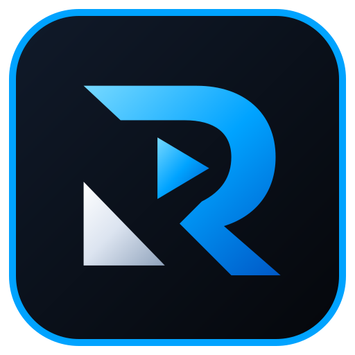

<!--
Copyright (c) 2026 Dave Beusing
david.beusing@gmail.com
-->

	

# rtaime Brand Assets

## Purpose

The repository contains one shared visual identity for the Operator application, product documentation and external presentation material.

The canonical product name remains **rtaime**, pronounced “realtime”, with the expansion **Real Time AI Media Engine** and the slogan **Production-grade real-time AI media platform.**

Brand assets are source-controlled and should be reused directly rather than recreated independently for individual documents or campaigns.

## Primary asset roles

| Asset | Role | Preferred use |
| --- | --- | --- |
| RtaimeLogoHorizontal.svg | Primary product lockup | README, website hero, presentations, one-pagers, showcase title surfaces |
| RtaimeEmblem.svg | Compact brand mark | UI headers, navigation, social/profile surfaces, compact documentation |
| RtaimeEmblemMonochrome.svg | Neutral mark | constrained backgrounds, print-like use, low-emphasis technical surfaces |
| RtaimeAppIcon.svg | Application identity | executable, launcher, installer and shortcut surfaces |

Do not create campaign-specific alternate logos when one of the canonical assets fits.

## Visual reference

	

	
	&nbsp;&nbsp;&nbsp;&nbsp;
	
	&nbsp;&nbsp;&nbsp;&nbsp;
	

The rendered references above use the exact source-controlled vectors consumed by the product. Documentation should link to these files rather than embedding copied vector geometry.

## Vector source assets

Reusable SVG files are stored under:

**src/Hosts/rtaime.Operator/Assets/Brand/**

The current set contains:

- RtaimeLogoHorizontal.svg
- RtaimeEmblem.svg
- RtaimeEmblemMonochrome.svg
- RtaimeAppIcon.svg

These files are the canonical vector sources for documentation, presentations, web/marketing export, installer artwork and raster exports.

## Documentation branding

The repository README should use the horizontal lockup as its hero mark.

Root-level example:

~~~html

	

~~~

Documents below **docs/** should use the same source asset through a relative path:

~~~html

	

~~~

Nested documentation must adjust the relative path rather than copying the SVG.

Branding in technical documentation should remain compact. The logo identifies the product; it must not push the document's technical purpose below excessive marketing chrome.

## Application resources

The Operator loads:

**src/Hosts/rtaime.Operator/Themes/Brand/RtaimeBrand.xaml**

Available resources include:

- RtaimeBrandEmblemImage — primary silver/electric-blue emblem.
- RtaimeBrandEmblemMonochromeImage — neutral single-colour emblem.
- RtaimeBrandAppIconImage — dark rounded app icon treatment.
- RtaimeBrandCompactLockupTemplate — compact product lockup.
- RtaimeBrandHeroLockupTemplate — startup/about presentation lockup.
- shared brand colours and gradient brushes.

WPF views should consume these resources through StaticResource instead of embedding duplicate path data.

Example:

~~~xml
<Image Source="{StaticResource RtaimeBrandEmblemImage}"
	Width="32"
	Height="32"
	Stretch="Uniform" />
~~~

The main Operator window uses the app icon resource, the emblem in the production top bar and the hero lockup during startup.

## UI icon system

Application action and workspace icons remain native WPF geometries in:

**src/Hosts/rtaime.Operator/Themes/Controls/RtaimeIcons.xaml**

The set covers production navigation, media, timeline, compositing, routing, monitoring, performance, health, alerts, settings, account, search, transport, record, upload/download and common editing actions.

Consumers should use the geometry through existing rtaime controls, for example:

~~~xml
<controls:RtaimeIconButton
	IconData="{StaticResource RtaimeIconMonitoringGeometry}"
	ToolTip="Monitoring" />
~~~

## Brand palette

| Token | Value | Purpose |
| --- | --- | --- |
| Deep Black | #05070B | Primary dark background |
| Graphite | #1A1F2B | Raised dark surfaces |
| Silver White | #E8ECF4 | Primary mark and high-contrast brand text |
| Electric Blue | #00A3FF | Brand accent and real-time highlight |
| Deep Blue | #0059C7 | Gradient depth |

The visual treatment should remain restrained in dense production UI. Strong glow and large-format treatments are reserved for startup, presentation and marketing surfaces.

## Usage principles

### Clear space

Keep the mark visually separated from dense text, status indicators and unrelated logos. Do not place operational warning badges directly over the brand mark.

### Background

Prefer the canonical dark product surfaces for the full-color lockup.

Use the monochrome emblem when the full-color mark would compete with technical content or another constrained surface.

### Scaling

Use the horizontal lockup when the product name needs to be recognized immediately.

Use the emblem only when the surrounding UI already identifies rtaime.

The app icon is not a substitute for the horizontal logo in presentations or documentation headers.

### Modification

Do not:

- distort the aspect ratio;
- rotate the mark;
- recolor individual paths for campaigns;
- add unsupported slogans inside the vector;
- recreate the wordmark with a substitute font;
- embed duplicate SVG path data in new UI views.

## Marketing surfaces

Recommended hierarchy:

1. horizontal logo;
2. canonical slogan;
3. concise audience-specific value proposition;
4. product screenshot or real workflow evidence when available;
5. clear CTA.

See [Marketing Strategy](MarketingStrategy.md) and [Product Identity](ProductIdentity.md) for messaging and claim rules.
